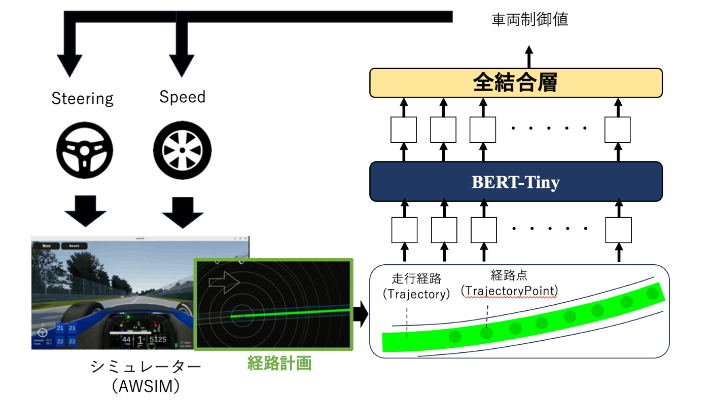
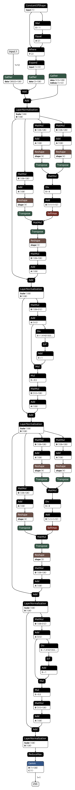

# VelocityTransformer

本リポジトリでは、走行経路を入力とし、車両制御コマンドを推定するモデルの構築・テスト・ONNXモデルへの変換が可能です。
詳細は[こちらの記事](https://zenn.dev/bushio_tech/articles/7ff1e37b109402)をご参照ください

# Datasets
事前に学習データセットを準備する必要があります。
データセットは以下のようなディレクトリ構成になります。
データセットの収集方法については[こちらの記事](https://zenn.dev/bushio_tech/articles/ca80640216138d)をご参照ください。
```
Datasets
├── NonReset
│   ├── 0001
│   │   ├── control
│   │   │     │ 
│   │   │     ├── 00001.npy
│   │   │     ├── 00002.npy
│   │   │     ├── 00003.npy
│   │   │     ├── ...
│   │   │     
│   │   ├── objects
│   │   ├── path
│   │   ├── pose
│   │   └── trajectory
│   │          │ 
│   │          ├── 00001.npy
│   │          ├── 00002.npy
│   │          ├── 00003.npy
│   │          ├── ...
│   │   
│   ├── 0002
│   ├── 0003
│   ├── 0004
│   ├── ...
```

# Install
以下を実行し、必要なライブラリをインストールしてください
```
python3 -m venv .venv
source .venv/bin/activate
pip install -r requirements.txt 
```
# Train
以下で、モデルの学習が実行できます。
### 速度推論モデル
以下のモデルを構築します。
- 入力：Trajectory
- 出力：速度
- 事前学習モデル: bert-tiny
```
python scripts/train.py model=bert-tiny
```
### ステアリング推論モデル
- 入力：Trajectory
- 出力：ステアリング
- 事前学習モデル: bert-tiny
```
python scripts/train.py model=bert-tiny_steering
```
# Predict
以下で、学習済みの.ckpt ファイルを使ってテストデータに対して推論できます。
{/path/to/trained_ckpt} に学習済みの .ckpt ファイルのパスを指定してください。
### 速度推論モデル
```
python scripts/predict.py ckpt={/path/to/trained_ckpt} 
```
### ステアリング推論モデル
```
python scripts/predict.py ckpt={/path/to/trained_ckpt} model=bert-tiny_steering
```

# ONNXファイルの作成方法
以下で、学習済みの .ckpt ファイルをONNXファイルに変換できる。
{/path/to/trained_ckpt} に学習済みの .ckpt ファイルのパスを指定してください。
### 速度推論モデル
```
python scripts/export_onnx.py ckpt={/path/to/trained_ckpt}
```

### ステアリング推論モデル
```
python scripts/export_onnx.py ckpt={/path/to/trained_ckpt} model=bert-tiny_steering
```

# モデルアーキテクチャ
使用するモデルの構造は以下のようになります。
- BERT-Tiny
